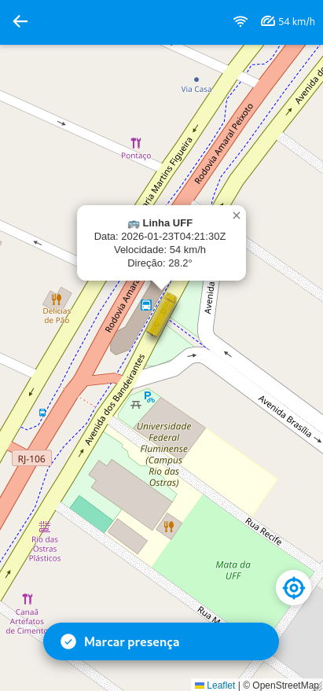

# Busuff Tracker

Busuff Tracker is a real-time bus localization system. It tracks buses using IoT GPS devices and display their positions live on a web map.

## Demo

<figure align="center">
    
    
</figure>

## How it works (simplified logic)

<figure align="center">
    
</figure>

## Project Structure

```bash
.
├── backend/        # API, MQTT client, database logic
├── frontend/       # Web app (React + Vite)
├── gps/            # Embedded firmware (ESP + GPS)
├── scripts/        # Build and helper scripts
├── docker-compose.yml
├── Caddyfile
└── README.md
```

## How to run

1. Write corresponding credentials in `.env.example`

2. Rename `.env.example` to `.env`

3. Having Docker installed, run:

```bash
docker compose up --build -d
```

## GPS data format (JSON)

```json
{
	"device": {
		"id": string,
	},
	"gps": {
		"timestamp_utc": string (ISO 8601 UTC time),
		"location" {
			"lat": float (*OPTIONAL*, 6 decimal places),
			"lng": float (*OPTIONAL*, 6 decimal places)
		},
		"speed_kmh": float (*OPTIONAL*, 1 decimal),
		"course_deg": float (*OPTIONAL*, 1 decimal, 0–360°, degrees from North),
		"num_satellites": int (*OPTIONAL*),
		"hdop": float (*OPTIONAL*, 2 decimal)
	}
}
```

## Examples

### Example 1 (Full GPS Fix)

```json
{
    "device": {
        "id": "14757629"
    },
    "gps": {
        "timestamp_utc": "2025-11-02T22:21:04Z",
        "location": {
            "lat": 60.424116,
            "lng": -22.814005
        },
        "speed_kmh": 0,
        "course_deg": 163.1,
        "num_satellites": 8,
        "hdop": 1.12
    }
}
```

### Example 2 (Partial GPS Fix)

- **Note**: Fields marked as optional may be omitted if the GPS signal quality is insufficient.

```json
{
    "device": {
        "id": "14757629"
    },
    "gps": {
        "timestamp_utc": "2025-11-02T22:21:04Z",
        "course_deg": 163.1,
        "num_satellites": 8,
        "hdop": 1.12
    }
}
```
