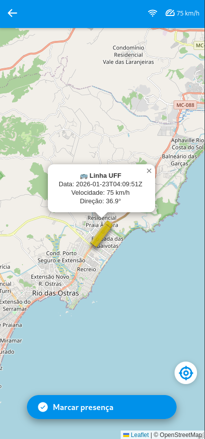
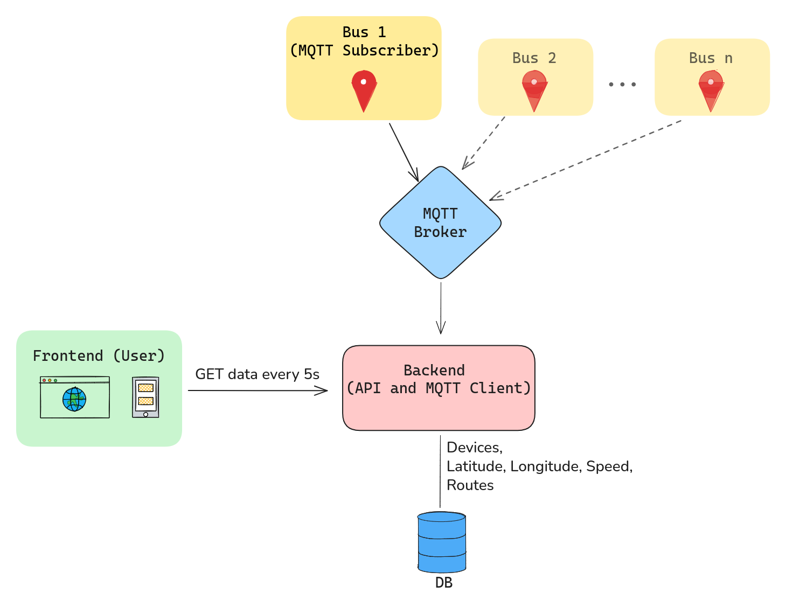

# Busuff Tracker

Busuff Tracker provides real-time bus localization by tracking GPS-equipped vehicles and displaying their live movements on a web interface.

# Demo

https://github.com/user-attachments/assets/f9e4eed6-0db8-446c-b77f-82831b9043d1

<p align="center">
    
    &nbsp;&nbsp;&nbsp;&nbsp;
    
</p>

## How it works (simplified logic)

<p align="center">
    
</p>

## Project Structure

```bash
.
├── backend/        # API, MQTT client, database logic
├── frontend/       # Web app (React + Vite)
├── gps/            # Embedded firmware (ESP + GPS)
├── docker-compose.yml
├── Caddyfile
└── README.md
```

## How to run

1. Write corresponding credentials in `.env.example`

2. Copy `.env.example` to `.env`

### Dev

```bash
docker compose \
  -f compose.yaml \
  -f compose.dev.yaml \
  up
```

### Prod

```bash
docker compose \
  -f compose.yaml \
  -f compose.prod.yaml \
  up
```
