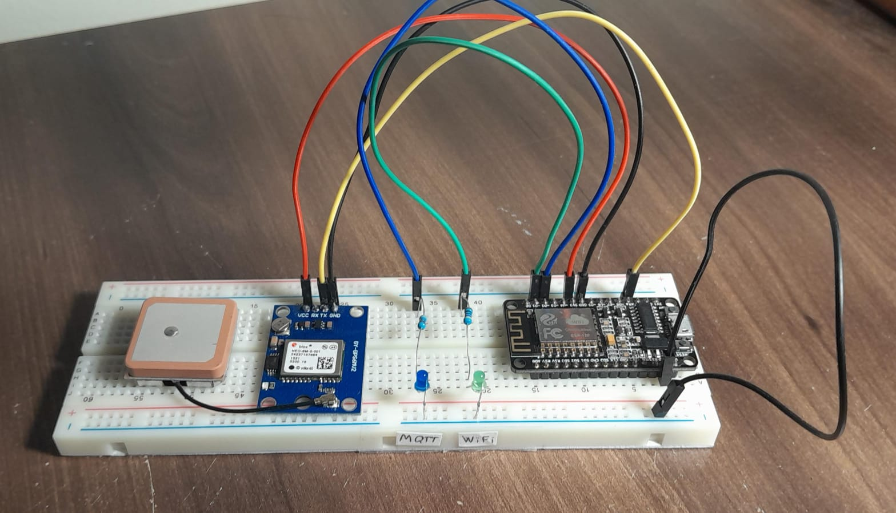

# GPS

Firmware for the ESP8266 that reads GPS data from a NEO-6M module and publishes JSON messages to an MQTT broker.

Two LEDs indicate connection states:

- Wi-Fi LED: ON = disconnected, OFF = connected
- MQTT LED: ON = disconnected, OFF = connected



## Getting Started

### Configure credentials

1. Write corresponding credentials in `./src/secrets.h.example`

2. Copy (or rename) `secrets.h.example` to `secrets.h`

### Build and upload

- Ensure PlatformIO (pio) is available in your PATH.

```bash
## Development build
pio run -e dev --target upload

## Production build
pio run -e prod --target upload
```

## JSON Payload Specification

All messages follow this schema:

```json
{
    "vehicle": {
        "id": string,
    },
    "gps": {
        "timestamp_utc": string (ISO 8601 UTC time),
        "location" {
            "lat": float (*OPTIONAL*, 6 decimal places),
            "lng": float (*OPTIONAL*, 6 decimal places)
        },
        "speed_kmh": float (*OPTIONAL*, 1 decimal),
        "course_deg": float (*OPTIONAL*, 1 decimal, 0–360°, degrees from North),
        "num_satellites": int (*OPTIONAL*),
        "hdop": float (*OPTIONAL*, 2 decimal)
    }
}
```

## References

- https://randomnerdtutorials.com/esp8266-nodemcu-neo-6m-gps-module-arduino/
- https://arduinojson.org/
- https://www.emqx.com/en/blog/esp8266-connects-to-the-public-mqtt-broker
- https://tttapa.github.io/ESP8266/Chap07%20-%20Wi-Fi%20Connections.html
- http://www.pequenosprojetos.com.br/rastreador-gps-sim800l-e-esp8266-node-mcu/
- https://stuartsprojects.github.io/2024/09/21/How-not-to-read-a-GPS.html
- https://arduino-esp8266.readthedocs.io/en/latest/esp8266wifi/station-examples.html
